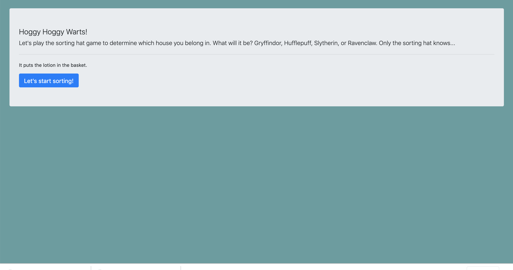
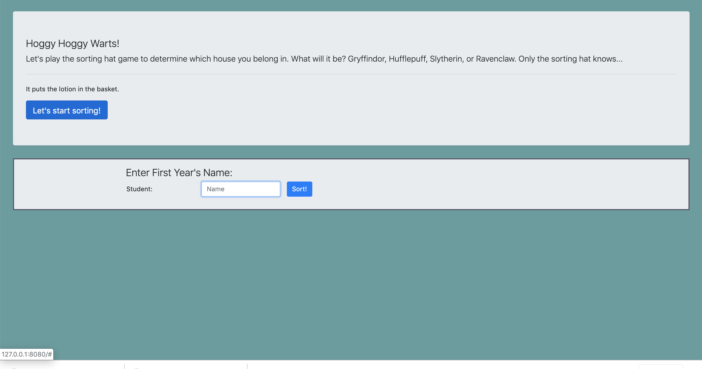
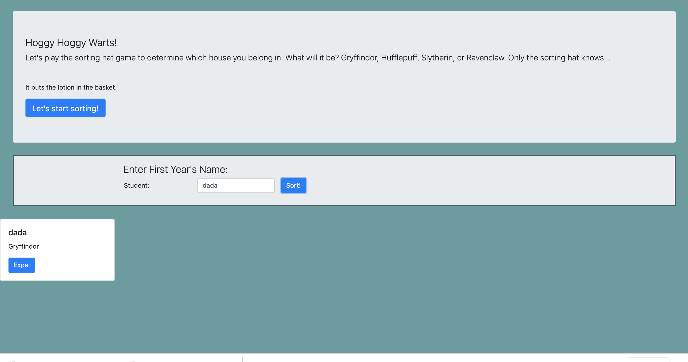

# Sorting-hat

## Technologies Used
HTML, CSS, Javascript, Bootstrap

## Description 

##

## How to run
* Clone down this project
* Install http-server from npm
* At the root of this project run the following command: hs -p 8888
* In your browser navigate to https://localhost: 8888